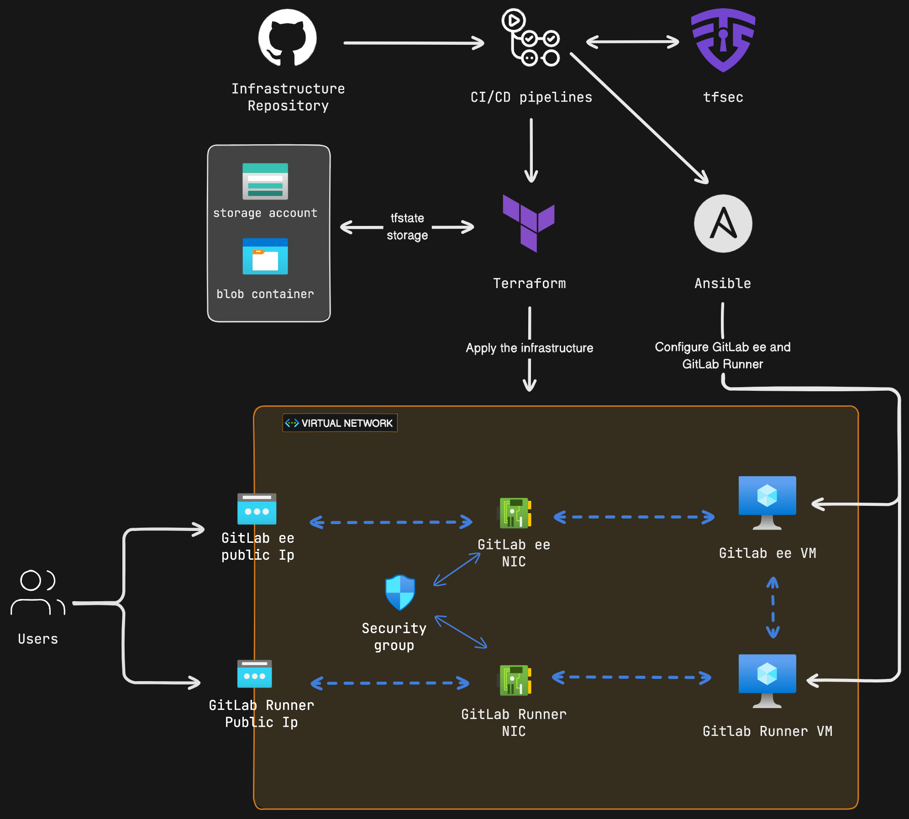
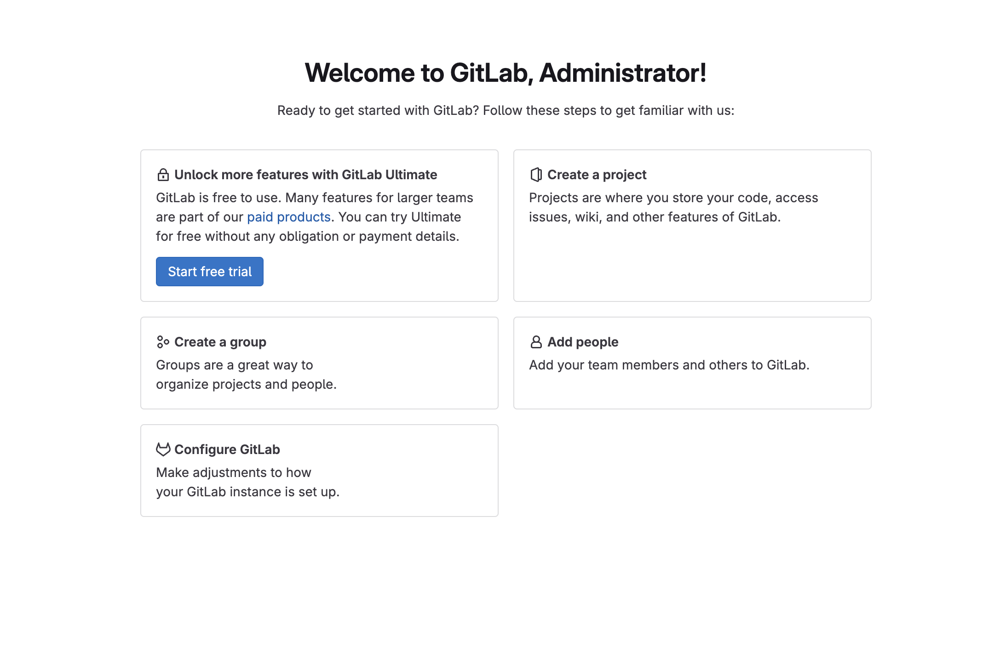
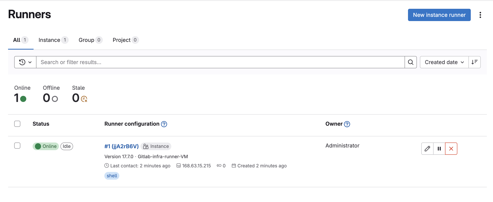
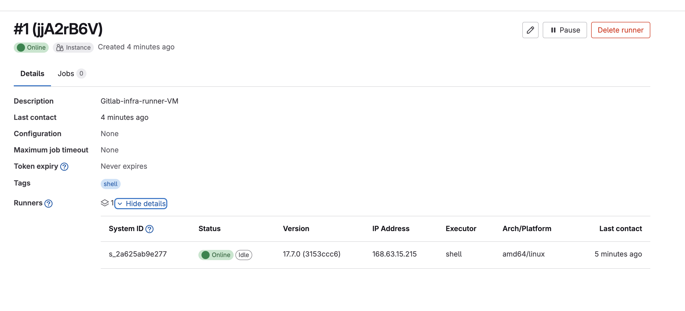

[](https://github.com/ozennou/code-keeper/actions/workflows/infra-pipeline.yml)

# **CodeGuard**

## **Overview**
- CodeGuard is a learning project where I apply my skills in Infrastructure as Code (IaC), Configuration Management, building CI/CD pipelines and GitLab.
- In this project, I use Terraform to create an Azure infrastructure composed of two VMs: one for the GitLab EE instance and one for the GitLab Runner, along with all the necessary components to make the GitLab instance accessible from the internet securely:



## Details
- In CodeGuard, I use Terraform to create the Azure infrastructure for the project by configuring the ```tfstate``` in Azure Blob Storage and creating the necessary resources for the infrastructure, such as VMs, NICs, security groups, and virtual networks.
- For the GitLab-EE configuration, I use Ansible to install GitLab-EE and all its dependencies, configure it, and also configure the GitLab Runner on the second VM, linking it to the GitLab instance so it's ready to execute jobs.
- All of this is automated, which is why I use GitHub Actions to create a pipeline that validates the code, scans for potential security risks, plans and applies the Terraform configuration, and then runs the Ansible playbooks to configure GitLab-EE and the GitLab Runner on the infrastructure VMs.

## Resources
### Storing terraform state in azure storage:
https://learn.microsoft.com/en-us/azure/developer/terraform/store-state-in-azure-storage?tabs=azure-cli
### Azure terraform resources docs:
https://registry.terraform.io/providers/hashicorp/azurerm/latest/docs
### Run Ansible playbooks on GitHub actions
https://groups.google.com/g/ansible-project/c/OZPu-b17n_w?pli=1




